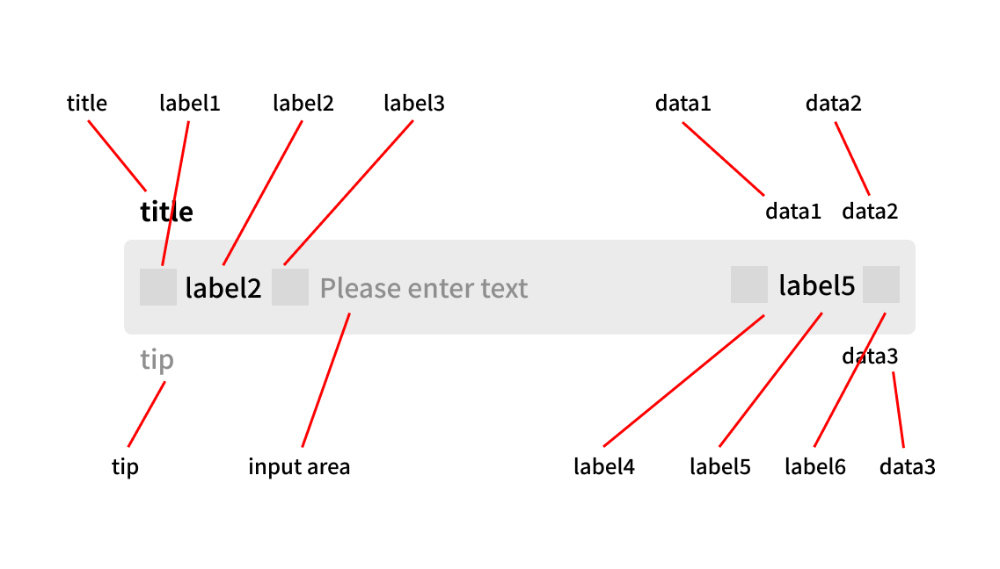

> Input uses the icon ri-close-circle-fill. Please ensure this icon is included in your project's symbol.svg file. For detailed information, please refer to [STDF-Guide-Icon](https://stdf.design/#/guide/icon).

## title and placeholder

If title is provided but placeholder is not, the Input component internally uses "Please enter + title" as the default placeholder. **At least one of title or placeholder must be provided**.

## type and inputmode

For inputmode, please refer to [MDN](https://developer.mozilla.org/zh-CN/docs/Web/HTML/Global_attributes/inputmode).

Considering mobile interaction characteristics, the Input component is mainly used for text input. Native input tag type values like file, radio, date, etc. have other component support or interaction methods. Additionally, type and inputmode have high overlap, with type adding password and number options on top of inputmode's base values. **Generally, you only need to pass type, though you can set inputmode separately if needed.**

Because the component internally processes input content, when rendering the final input to the page, all type values except password will be converted to text. Please convert the return value type as needed.

## Listening to Key Events

The Input component internally listens to keyboard events. When any key is pressed, it triggers the onkeydown event, returning a `value` representing the pressed key (Note: keyCode is deprecated, refer to [MDN](https://developer.mozilla.org/zh-CN/docs/Web/API/KeyboardEvent/keyCode)). You can handle this value for special processing. See examples.

## Configuration Options

All configurable items of the Input component are shown in the image below.

Typically, label1, label3, label4, and label6 use Icon Props, while label2 and label5 use text.

Of course, if these configuration options don't meet your needs, they all support Snippet rendering. Please refer to the examples.

## textarea

The parameters textareaMaxlength, rows, and autosize only take effect when type is 'textarea', and when autosize is true, rows will be ineffective.

## CJK Input

When inputting Chinese, Japanese, Korean, or other text that involves a character selection process, the component internally validates input length, content, and other information **only after the content is committed to the screen**.
