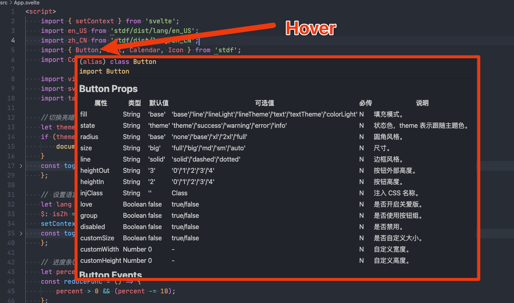
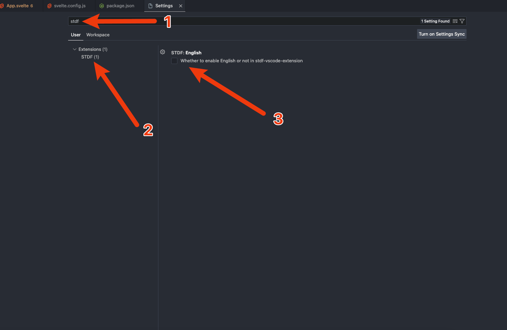

[English](https://github.com/dufu1991/stdf/blob/main/packages/vscode-extension/README.md)

# 介绍

一个 VS Code 插件，用于在使用 [STDF](https://stdf.design) 开发时提供一些便利。

# 安装

在 VS Code 插件中搜索 `stdf-vscode-extension` 点击安装，或到 VS Code 插件市场安装 [stdf-vscode-extension](https://marketplace.visualstudio.com/items?itemName=STDF.stdf-vscode-extension&ssr=false#overview)。

# 功能

### 光标悬浮于 STDF 组件名称上时，显示该组件的API。

# 配置

默认显示的 API 为简体中文，可到 VS Code 的设置页开启英文 API。

# 许可证

本项目基于 [MIT 许可证](https://github.com/dufu1991/stdf/blob/main/LICENSE)。请随意享受并贡献给这个开源项目。